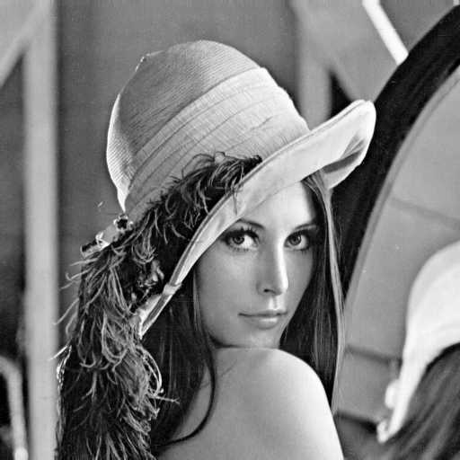
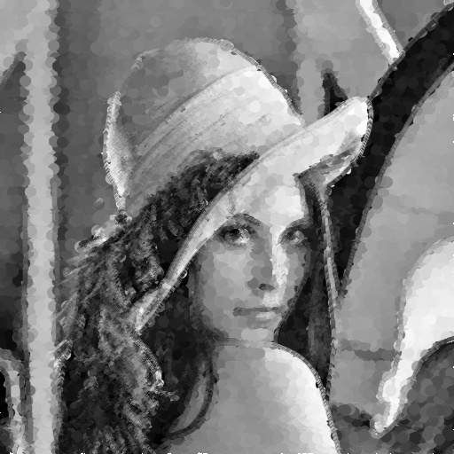

### Alberto Tavares de Oliveira
### Francisco Bianor Souza de Medeiros

## Sumário
- [Sumário](#sumário)
  - [1 - Manipulando pixels em uma imagem](#1---manipulando-pixels-em-uma-imagem)
    - [Exercício 1.1 - regions.cpp](#exercício-11---regionscpp)
    - [Exercício 1.2 - trocaregioes.cpp](#exercício-12---trocaregioescpp)
  - [2 - Preenchendo regiões](#2---preenchendo-regiões)
    - [Exercício 2.1 - labelingRGB.cpp](#exercício-21---labelingrgbcpp)
    - [Exercício 2.2 - labelingholes.cpp](#exercício-22---labelingholescpp)
  - [3 - Manipulação de histogramas](#3---manipulação-de-histogramas)
    - [Exercício 3.1 - equalize.cpp](#exercício-31---equalizecpp)
    - [Exercício 3.2 - motiondetector.cpp](#exercício-32---motiondetectorcpp)
  - [4 - Filtragem no domínio espacial i](#4---filtragem-no-domínio-espacial-i)
    - [Exercício 4.1 - laplgauss.cpp](#exercício-41---laplgausscpp)
  - [5 - Filtragem no domínio espacial ii](#5---filtragem-no-domínio-espacial-ii)
    - [Exercício 5.1 - tiltshift.cpp](#exercício-51---tiltshiftcpp)
    - [Exercício 5.2 - tiltshiftvideo.cpp](#exercício-52---tiltshiftvideocpp)
  - [6 - Filtragem no domínio da frequência](#6---filtragem-no-domínio-da-frequência)
    - [Exercício 6.1 - filtrohomomorfico.cpp](#exercício-61---filtrohomomorficocpp)
  - [7 - Detecção de bordas com o algoritmo de Canny](#7---detecção-de-bordas-com-o-algoritmo-de-canny)
    - [Exercício 7.1 - cannypoints.cpp](#exercício-71---cannypointscpp)
  - [Jekyll Themes](#jekyll-themes)
  - [Support or Contact](#support-or-contact)

Esta página é dedicada às respostas dos exercicios de programação da disciplina de Processamento Digital de Imagens da UFRN da dupla Alberto Tavares de Oliveira e Francisco Bianor Souza de Medeiros. Os exercícios de programação foram resolvidos usando a linguagem *c++* com o auxílio da biblioteca de manipulação de imagens *opencv*. 

### 1 - Manipulando pixels em uma imagem

#### Exercício 1.1 - regions.cpp

Este exercício consiste na implementação de um código capaz de substituir uma região retangular predefinida de uma imagem com seu negativo. Neste exemplo em questão, como se trata de uma imagem em escala de cinza, basta subtrair o valor do pixel de 255 e atribuir o resultado ao novo valor do pixel. Caso a imagem fosse colorida, seria necessário alterar o código para manipular cada uma das componentes RGB associados ao pixel. Para o exemplo em questão foram usados os pontos P1(20, 50) e P2(200, 200) para definir a região retangular em que os pixels serão invertidos. Foi usada a imagem *biel.png* como exemplo.

Imagem utilizada e a imagem obtida usando os pontos P1(20, 50) e P2(200, 200):

 

Código [regions.cpp](https://raw.githubusercontent.com/Albertotavaresdeoliveira/PDI-UFRN/gh-pages/regions.cpp):

```c++
#include <iostream>
#include <opencv2/opencv.hpp>

using namespace cv;
using namespace std;

int main(int, char**){
  cv::Mat image;
  cv::Point p1, p2;

  image= cv::imread("biel.png",cv::IMREAD_GRAYSCALE);
  if(!image.data)
    std::cout << "nao abriu a imagem" << std::endl;

    cout<<"Digite P1 e P2 (x1,y1,x2,y2):"<<endl;
    cin>>p1.x >> p1.y >> p2.x >> p2.y;

  cv::namedWindow("janela", cv::WINDOW_AUTOSIZE);

  for(int i=p1.x;i<p2.x;i++){
    for(int j=p1.y;j<p2.y;j++){
       image.at<uchar>(i,j) = 255 - image.at<uchar>(i,j);
    }
  }

  cv::imshow("negativo da imagem", image);
  cv::imwrite("negativo da imagem.png", image);
  cv::waitKey();
  return 0;
}
```

#### Exercício 1.2 - trocaregioes.cpp

O código a seguir foi implementado de forma a trocar os quadrantes de uma imagem ao longo das diagonais. Foi usada a imagem *biel.png* como exemplo.

Imagem utilizada e imagem obtida:

  

Código [trocaregioes.cpp](https://raw.githubusercontent.com/Albertotavaresdeoliveira/PDI-UFRN/gh-pages/trocaregioes.cpp):

```c++
#include <iostream>
#include <opencv2/opencv.hpp>

using namespace cv;
using namespace std;

int main(int, char**){
  cv::Mat image, quadrantes;
  int width, height;

  image= cv::imread("biel.png",cv::IMREAD_GRAYSCALE);
  if(!image.data)
    std::cout << "nao abriu a imagem" << std::endl;

  cv::namedWindow("janela", cv::WINDOW_AUTOSIZE);

  quadrantes = image.clone();

  width=image.cols;
  height=image.rows;
  std::cout << width << "x" << height << std::endl;

  for(int i=0; i<height/2; i++){
    for(int j=0; j<width/2; j++){
      quadrantes.at<uchar>(i,width/2+j) = image.at<uchar>(height/2+i,j); //1° quadrante
      quadrantes.at<uchar>(i,j) = image.at<uchar>(height/2+i,width/2+j); //2° quadrante
      quadrantes.at<uchar>(height/2+i,j) = image.at<uchar>(i,width/2+j); //3° quadrante
      quadrantes.at<uchar>(height/2+i,width/2+j) = image.at<uchar>(i,j); //4° quadrante
    }
  }

  cv::imshow("imagem original", image);
  cv::imshow("quadrantes trocados", quadrantes);
  cv::imwrite("quadrantes trocados.png", quadrantes);
  cv::waitKey();
  return 0;
}
```

### 2 - Preenchendo regiões

#### Exercício 2.1 - labelingRGB.cpp

Este exercício consiste de implementar um código capaz de rotular mais de 255 objetos em uma imagem. A rotulação consiste de preencher uma região com uma determinada cor, no opencv pode ser feita usando a função *floodFill()*. À priori, somente é possivel rotular 255 regiões usando a escala de cinza, visto que a região é rotulada com o valor da cor em escala de cinza, podendo assumir 255 tons distintos.
Uma forma de identificar mais de 255 objetos é realizar a rotulação com diversas cores, ao invés de somente na escala de cinza. Para esse exemplo foi implementado o código abaixo usando a imagem *bolhas.png*.

Imagem utilizada e imagem obtida:

   

Código [labelingRGB.cpp](https://raw.githubusercontent.com/Albertotavaresdeoliveira/PDI-UFRN/gh-pages/labelingRGB.cpp):

```c++
#include <iostream>
#include <opencv2/opencv.hpp>

using namespace cv;
using namespace std;

int main(int argc, char** argv){
  cv::Mat original, image, semobjnasbordas, realce;
  cv::Vec3b val, B, P, C;
  int width, height, nobjects = 0;

  //Branco
  B[0] = 255; B[1] = 255; B[2] = 255;
  //Preto
  P[0] = 0; P[1] = 0; P[2] = 0;
  //Cinza
  C[0] = 127; C[1] = 127; C[2] = 127;

  cv::Point p;
  //image = cv::imread(argv[1], cv::IMREAD_GRAYSCALE);
  image= cv::imread(argv[1],cv::IMREAD_COLOR);
  original = image.clone();

  if(!image.data){ std::cout << "imagem nao carregou corretamente\n"; return(-1); }

  width=image.cols; height=image.rows;
  cout << width << "x" << height << endl;

  p.x=0; p.y=0;

  //Processo para gerar imagem apenas em preto e branco (elimina tons intermediários)
  for(int i=0; i<height; i++){
    for(int j=0; j<width; j++){
      if(image.at<uchar>(i,j) >= 127) { image.at<uchar>(i,j) = 255; }
      else { image.at<uchar>(i,j) = 0; }
    }
  }

  semobjnasbordas = image.clone();

  //Removendo os objetos das 4 bordas
  for(int i=0; i<height; i++){
      if(semobjnasbordas.at<Vec3b>(i,0) == B){  p.x=0; p.y=i; cv::floodFill(semobjnasbordas,p,P); }
    }

  for(int i=0; i<height; i++){
      if(semobjnasbordas.at<Vec3b>(i,width-1) == B){ p.x=width-1; p.y=i; cv::floodFill(semobjnasbordas,p,P); }
    }
    
  for(int j=0; j<width; j++){
      if(semobjnasbordas.at<Vec3b>(0,j) == B){ p.x=j; p.y=0; cv::floodFill(semobjnasbordas,p,P); }
    }

  for(int j=0; j<width; j++){
      if(semobjnasbordas.at<Vec3b>(height-1,j) == B){ p.x=j; p.y=height-1; cv::floodFill(semobjnasbordas,p,P); }
    }

    image = semobjnasbordas.clone();

    val[0] = 0; //B
    val[1] = 0; //G
    val[2] = 0; //R

    // busca objetos presentes
  for(int i=0; i<height; i++){
    for(int j=0; j<width; j++){
      if(image.at<Vec3b>(i,j) == B){
        // achou um objeto
        p.x=j; p.y=i; nobjects++;
        val[0] = 0;
        val[1] = nobjects % 255;
        val[2] = nobjects - ((nobjects % 255) * 255);

  		  // preenche o objeto com o contador
        //cv::floodFill(image,p,cv::Scalar((val[0]), (val[1]), (val[2]), 0));
        //cv::floodFill(image,p,cv::Scalar((val[0]), (val[1]), (val[2]), 0));
        cv::floodFill(image,p,val);
      }
    }
  }

  cout << "a figura tem " << nobjects << " bolhas" << endl;
  //cv::equalizeHist(image, realce);
  cv::imshow("imagem original clone", original);
  cv::imshow("image", image);
  cv::imshow("sem objetos que tocam as bordas", semobjnasbordas);
  cv::imwrite("labelingRGB.png", image);
  cv::waitKey();
  return 0;
}
```

#### Exercício 2.2 - labelingholes.cpp

Este exercício consiste na rotulação de regiões e contagem de objetos, que não tocam na borda da imagem, com e sem buracos internos. Para o algorítimo foi previsto também que objetos com mais de um buraco também podem existir. Foi usado como exemplo a imagem *bolhas2buracos.png* modificada da imagem original *bolhas.png*. A modificação da imagem consiste numa bolha com mais de um buraco para validação do código. Dado uma imagem inicial, a sequência de passos no processamento consiste de: 

1-Carregamento da imagem inicial.

2-Remoção de regiões que tocam as bordas.

3-Rotulação para contagem do número de bolhas.

4-Preencher o fundo de branco usando pixel (0,0).

5-Varrer novamente a imagem buscando regiões pretas (buracos) e preencher estas regiões com preto e depois com branco a fim de contar e eliminar essas regiões.

Sequência do processamento da imagem:

      

   

Abaixo é mostrado a saída no terminal de comando:

 

Código [labelingholes.cpp](https://raw.githubusercontent.com/Albertotavaresdeoliveira/PDI-UFRN/gh-pages/labelingholes.cpp):

```c++
#include <iostream>
#include <opencv2/opencv.hpp>

using namespace cv;

int main(int argc, char** argv){
  cv::Mat original, image, semobjnasbordas, realce;
  int width, height, nobjects = 0, objcomburacos = 0;

  cv::Point p;
  image = cv::imread(argv[1], cv::IMREAD_GRAYSCALE);
  original = image.clone();

  if(!image.data){ std::cout << "imagem nao carregou corretamente\n"; return(-1); }

  width=image.cols; height=image.rows;
  std::cout << width << "x" << height << std::endl;

  p.x=0; p.y=0;

  //Processo para gerar imagem apenas em preto e branco (elimina tons intermediários)
  for(int i=0; i<height; i++){
    for(int j=0; j<width; j++){
      if(image.at<uchar>(i,j) >= 127) { image.at<uchar>(i,j) = 255; }
      else { image.at<uchar>(i,j) = 0; }
    }
  }

  semobjnasbordas = image.clone();

  //Removendo os objetos das 4 bordas
  for(int i=0; i<height; i++){
      if(semobjnasbordas.at<uchar>(i,0) == 255){  p.x=0; p.y=i; cv::floodFill(semobjnasbordas,p,0); }
    }

  for(int i=0; i<height; i++){
      if(semobjnasbordas.at<uchar>(i,width-1) == 255){ p.x=width-1; p.y=i; cv::floodFill(semobjnasbordas,p,0); }
    }
    
  for(int j=0; j<width; j++){
      if(semobjnasbordas.at<uchar>(0,j) == 255){ p.x=j; p.y=0; cv::floodFill(semobjnasbordas,p,0); }
    }

  for(int j=0; j<width; j++){
      if(semobjnasbordas.at<uchar>(height-1,j) == 255){ p.x=j; p.y=height-1; cv::floodFill(semobjnasbordas,p,0); }
    }

    image = semobjnasbordas.clone();

    // busca objetos presentes
  for(int i=0; i<height; i++){
    for(int j=0; j<width; j++){
      if(image.at<uchar>(i,j) == 255){
        // achou um objeto
        p.x=j; p.y=i; nobjects++;
  		  // preenche o objeto com o contador
		    cv::floodFill(image,p,nobjects);
      }
    }
  }

    //alterar a cor de fundo da imagem de preto para branco
    p.x=0; p.y=0; cv::floodFill(image,p,255);

    cv::imshow("image fundo branco", image);

    //Contagem de objetos com buracos
  for(int i=0; i<height; i++){
    for(int j=0; j<width; j++){
      if(image.at<uchar>(i,j) == 0){ 
        objcomburacos++;
        for(int k=j; k<width; k++){
          if(image.at<uchar>(i,k) != 0){ p.x=k; p.y=i; cv::floodFill(image,p,0); cv::floodFill(image,p,255); break;}
        }
      }
    }
  }

  cv::imshow("image buracos preenchidos", image);

  std::cout << "a figura tem " << nobjects << " bolhas, sendo " << objcomburacos << " bolhas com buracos\n";
  //cv::equalizeHist(image, realce);
  cv::imshow("imagem original clone", original);
  //cv::imshow("image", image);
  cv::imshow("sem objetos que tocam as bordas", semobjnasbordas);
  cv::imwrite("labeling.png", image);
  cv::waitKey();
  return 0;
}
```

### 3 - Manipulação de histogramas

#### Exercício 3.1 - equalize.cpp

Este exercício consiste na equalização dos histogramas dos frames capturados por uma câmera de video. A câmera captura os frames e os converte para tons de cinza. Os histogramas de cada frame são calculados pela função *calcHist()* do opencv, e em seguida são equalizados pela função *equalizeHist()*. Os histogramas gerados são exibidos em tempo real no canto superior esquerdo dos frames.

Abaixo é mostrado a comparação entre dois videos e seus histogramas, sendo o segundo video a equalização do primeiro, perceba como os tons são separados podendo assim perceber detalhes que não estavam evidentes no primeiro video:


Código [equalize.cpp](https://raw.githubusercontent.com/Albertotavaresdeoliveira/PDI-UFRN/gh-pages/equalize.cpp):

```c++
#include <iostream>
#include <opencv2/opencv.hpp>

using namespace cv;
using namespace std;

int main(int argc, char** argv){
  Mat image, escalacinza, escalacinzaeq, histCinza, histCinzaeq;
  int width, height;
  VideoCapture cap;
  int nbins = 64;
  float range[] = {0, 255};
  const float *histrange = { range };
  bool uniform = true;
  bool acummulate = false;
  int key;

	cap.open(0);
  if(!cap.isOpened()){ cout << "cameras indisponiveis"; return -1; }

  cap.set(CAP_PROP_FRAME_WIDTH, 640);
  cap.set(CAP_PROP_FRAME_HEIGHT, 480);
  width = cap.get(CAP_PROP_FRAME_WIDTH);
  height = cap.get(CAP_PROP_FRAME_HEIGHT);

  cout << "largura = " << width << endl;
  cout << "altura  = " << height << endl;

  int histw = nbins, histh = nbins/2;
  Mat histImgCinza(histh, histw, CV_8UC1, Scalar(0));
  Mat histImgCinzaEq(histh, histw, CV_8UC1, Scalar(0));

  while(1){
    cap >> image;
    cvtColor(image,escalacinza, COLOR_RGB2GRAY);

    //Equalização
    equalizeHist(escalacinza, escalacinzaeq);

    calcHist(&escalacinza, 1, 0, Mat(), histCinza, 1, &nbins, &histrange, uniform, acummulate);
    calcHist(&escalacinzaeq, 1, 0, Mat(), histCinzaeq, 1, &nbins, &histrange, uniform, acummulate);

    normalize(histCinza, histCinza, 0, histImgCinza.rows, NORM_MINMAX, -1, Mat());
    normalize(histCinzaeq, histCinzaeq, 0, histImgCinzaEq.rows, NORM_MINMAX, -1, Mat());

    histImgCinza.setTo(Scalar(0));
    histImgCinzaEq.setTo(Scalar(0));

    for(int i=0; i<nbins; i++){
      line(histImgCinza, Point(i, histh), Point(i, histh-cvRound(histCinza.at<float>(i))), Scalar(255, 255, 255), 1, 8, 0);
      line(histImgCinzaEq, Point(i, histh), Point(i, histh-cvRound(histCinzaeq.at<float>(i))), Scalar(255, 255, 255), 1, 8, 0);
    }

    histImgCinza.copyTo(escalacinza(Rect(0, 0, nbins, histh)));
    histImgCinzaEq.copyTo(escalacinzaeq(Rect(0, 0, nbins, histh)));

    imshow("image", escalacinza);
    imshow("imagem escala de cinza", escalacinzaeq);
    key = waitKey(30);
    if(key == 27) break;
    if(key == 32) { imwrite("Imagem em cinza.png", escalacinza); imwrite("Equalizada.png", escalacinzaeq);break;}
  }
  return 0;
}
```

#### Exercício 3.2 - motiondetector.cpp

Este exercício consiste na implementação de um código capaz de detectar movimentos em uma câmera de video usando conceitos de histogramas. A ideia consiste em constantemente se calcular os histogramas dos frames capturados pela câmera. O histograma é comparado com o anterior e caso a diferença entre eles seja maior que um limiar predeterminado ele executa a detecção do movimento. A detecção neste exemplo é representada pelo desenho de um círculo branco no centro da imagem.


Código [motiondetector.cpp](https://raw.githubusercontent.com/Albertotavaresdeoliveira/PDI-UFRN/gh-pages/motiondetector.cpp):

```c++
#include <iostream>
#include <opencv2/opencv.hpp>

using namespace cv;
using namespace std;

int main(int argc, char** argv){
  Mat image, escalacinza, histAnterior, histNovo;
  int width, height;
  VideoCapture cap;
  int nbins = 64;
  float range[] = {0, 255};
  const float *histrange = { range };
  bool uniform = true;
  bool acummulate = false;
  int key;

  cap.open(0);
  if(!cap.isOpened()){ cout << "cameras indisponiveis"; return -1; }

  cap.set(CAP_PROP_FRAME_WIDTH, 640);
  cap.set(CAP_PROP_FRAME_HEIGHT, 480);
  width = cap.get(CAP_PROP_FRAME_WIDTH);
  height = cap.get(CAP_PROP_FRAME_HEIGHT);

  Point Centro(width/2, height/2);

  cout << "largura = " << width << endl;
  cout << "altura  = " << height << endl;

  int histw = nbins, histh = nbins/2;
  Mat histImgAnterior(histh, histw, CV_8UC1, Scalar(0));
  Mat histImgNovo(histh, histw, CV_8UC1, Scalar(0));

  double Dif = 0, Limiar = 0.999;
  
  cap >> image;
  cvtColor(image,escalacinza, COLOR_RGB2GRAY);
  calcHist(&escalacinza, 1, 0, Mat(), histAnterior, 1, &nbins, &histrange, uniform, acummulate);
  normalize(histAnterior, histAnterior, 0, histImgAnterior.rows, NORM_MINMAX, -1, Mat());

  while(1){
    cap >> image;
    cvtColor(image,escalacinza, COLOR_RGB2GRAY);
    calcHist(&escalacinza, 1, 0, Mat(), histNovo, 1, &nbins, &histrange, uniform, acummulate);
    normalize(histNovo, histNovo, 0, histImgNovo.rows, NORM_MINMAX, -1, Mat());

    histImgNovo.setTo(Scalar(0));

    Dif = compareHist(histAnterior, histNovo, HISTCMP_CORREL);
    //Dif = compareHist(histAnterior, histNovo, HISTCMP_CHISQR);
    //Dif = compareHist(histAnterior, histNovo, HISTCMP_INTERSECT);
    //Dif = compareHist(histAnterior, histNovo, HISTCMP_BHATTACHARYYA);
    //Dif = compareHist(histAnterior, histNovo, HISTCMP_HELLINGER );

    if(Dif<=Limiar) { circle(escalacinza, Centro, 50, Scalar(255, 255, 255), FILLED, LINE_8 ); }

    for(int i=0; i<nbins; i++){
      line(histImgNovo, Point(i, histh), Point(i, histh-cvRound(histNovo.at<float>(i))), Scalar(255, 255, 255), 1, 8, 0);
    }

    histImgNovo.copyTo(escalacinza(Rect(0, 0, nbins, histh)));
    
    histAnterior = histNovo.clone();

    imshow("image", escalacinza);
    key = waitKey(30);
    if(key == 27) break;
  }
  return 0;
}
```

### 4 - Filtragem no domínio espacial i

#### Exercício 4.1 - laplgauss.cpp

Este exercício consiste em filtrar imagens usando o filtro laplaciano do gaussiano e comparar com o filtro laplaciano.
Abaixo é mostrado a filtragem obtida de imagens capturadas pela câmera usando o filtro laplaciano seguido do laplaciano do gaussiano e as máscaras usadas no processo. A filtragem pode ser obtida usando a função *filter2D()* do opencv, juntamente com o uso da máscara do laplaciano do gaussiano que foi adicionada às já existentes no código original. Perceba o aumento do destaque das bordas ao se utilizar o laplaciano do gaussiano.


Código [laplgauss.cpp](https://raw.githubusercontent.com/Albertotavaresdeoliveira/PDI-UFRN/gh-pages/laplgauss.cpp):

```c++
#include <iostream>
#include <opencv2/opencv.hpp>

using namespace cv;
using namespace std;

void printmask(Mat &m) {
  for (int i = 0; i < m.size().height; i++) {
    for (int j = 0; j < m.size().width; j++) {
      std::cout << m.at<float>(i, j) << ",";
    }
    std::cout << "\n";
  }
}

int main(int, char **) {
  VideoCapture cap;  // open the default camera
  float media[] = {0.1111, 0.1111, 0.1111, 0.1111, 0.1111,
                   0.1111, 0.1111, 0.1111, 0.1111};
  float gauss[] = {0.0625, 0.125,  0.0625, 0.125, 0.25,
                   0.125,  0.0625, 0.125,  0.0625};
  float horizontal[] = {-1, 0, 1, -2, 0, 2, -1, 0, 1};
  float vertical[] = {-1, -2, -1, 0, 0, 0, 1, 2, 1};
  float laplacian[] = {0, -1, 0, -1, 4, -1, 0, -1, 0};
  float boost[] = {0, -1, 0, -1, 5.2, -1, 0, -1, 0};
  float log[] = {0, 0, 1, 0, 0, 0, 1, 2, 1, 0, 1, 2, -16, 2, 1, 0, 1, 2, 1, 0, 0, 0, 1, 0, 0}; //laplaciano do gaussiano

  Mat frame, framegray, frame32f, frameFiltered;
  Mat mask(3, 3, CV_32F);
  Mat result;
  double width, height;
  int absolut;
  char key;

  cap.open(0);

  if (!cap.isOpened())  // check if we succeeded
    return -1;

  cap.set(CAP_PROP_FRAME_WIDTH, 640);
  cap.set(CAP_PROP_FRAME_HEIGHT, 480);
  width = cap.get(CAP_PROP_FRAME_WIDTH);
  height = cap.get(CAP_PROP_FRAME_HEIGHT);
  std::cout << "largura=" << width << "\n";
  ;
  std::cout << "altura =" << height << "\n";
  ;
  std::cout << "fps    =" << cap.get(CAP_PROP_FPS) << "\n";
  std::cout << "format =" << cap.get(CAP_PROP_FORMAT) << "\n";

  namedWindow("filtroespacial", WINDOW_NORMAL);
  namedWindow("original", WINDOW_NORMAL);

  mask = Mat(3, 3, CV_32F, media);

  absolut = 1;  // calcs abs of the image

  for (;;) {
    cap >> frame;  // get a new frame from camera
    cvtColor(frame, framegray, COLOR_BGR2GRAY);
    flip(framegray, framegray, 1);
    imshow("original", framegray);
    framegray.convertTo(frame32f, CV_32F);
    filter2D(frame32f, frameFiltered, frame32f.depth(), mask,
                 Point(1, 1), 0);
    if (absolut) {
      frameFiltered = abs(frameFiltered);
    }

    frameFiltered.convertTo(result, CV_8U);

    imshow("filtroespacial", result);

    key = (char)waitKey(10);
    if (key == 27) break;  // esc pressed!
    switch (key) {
      case 'a':
        absolut = !absolut;
        break;
      case 'm':
        mask = Mat(3, 3, CV_32F, media);
        printmask(mask);
        break;
      case 'g':
        mask = Mat(3, 3, CV_32F, gauss);
        printmask(mask);
        break;
      case 'h':
        mask = Mat(3, 3, CV_32F, horizontal);
        printmask(mask);
        break;
      case 'v':
        mask = Mat(3, 3, CV_32F, vertical);
        printmask(mask);
        break;
      case 'l':
        mask = Mat(3, 3, CV_32F, laplacian);
        printmask(mask);
        break;
      case 'b':
        mask = Mat(3, 3, CV_32F, boost);
        break;
      case 'z'://laplaciano do gaussiano
        mask = Mat(5, 5, CV_32F, log);
        printmask(mask);
        break;   
      default:
        break;
    }
  }
  return 0;
}
```

### 5 - Filtragem no domínio espacial ii

#### Exercício 5.1 - tiltshift.cpp

Abaixo é mostrado o resultado da execução do programa tiltshift.cpp com os 3 ajustes na tela de interface. Foi usado como exemplo a imagem *blend2.jpg*, mas qualquer imagem pode ser usada. Com esse programa é possível alterar os sliders de decaimento, altura e posição e com isso gerar uma imagem que é o resultado do tiltshift. Após a finalização da execução do código, uma imagem *tiltshift.png* é salva.

Resultado do tiltshift aplicado à imagem blend2.jpg:

  


Código [tiltshift.cpp](https://raw.githubusercontent.com/Albertotavaresdeoliveira/PDI-UFRN/gh-pages/tiltshift.cpp):

```c++
#include <iostream>
#include <cstdio>
#include <opencv2/opencv.hpp>

using namespace cv;
using namespace std;

double decaim;
int decaim_slider = 100;
int decaim_slider_max = 100;

int height_slider = 20;
int height_slider_max = 100;

int position_slider = 50;
int position_slider_max = 100;

int height_focus = 50; // altura da regiao central em foco
int position_focus = 50; // posição do centro da regiao central em foco

Mat image1, image2, blended, imgfiltered, imgpondered;
Mat imageTop; 

char TrackbarName[50];

int absolut = 1;

//float media[] = {0.1111, 0.1111, 0.1111, 0.1111, 0.1111, 0.1111, 0.1111, 0.1111, 0.1111};
//float media[] = {0.0625, 0.0625, 0.0625, 0.0625, 0.0625, 0.0625, 0.0625, 0.0625, 0.0625, 0.0625, 0.0625, 0.0625, 0.0625, 0.0625, 0.0625, 0.0625};
/*
float media[] = { 0.04, 0.04, 0.04, 0.04, 0.04,
                  0.04, 0.04, 0.04, 0.04, 0.04, 
                  0.04, 0.04, 0.04, 0.04, 0.04, 
                  0.04, 0.04, 0.04, 0.04, 0.04, 
                  0.04, 0.04, 0.04, 0.04, 0.04 }; */

float media[] = { 0.0278, 0.0278, 0.0278, 0.0278, 0.0278, 0.0278, 
                  0.0278, 0.0278, 0.0278, 0.0278, 0.0278, 0.0278, 
                  0.0278, 0.0278, 0.0278, 0.0278, 0.0278, 0.0278, 
                  0.0278, 0.0278, 0.0278, 0.0278, 0.0278, 0.0278, 
                  0.0278, 0.0278, 0.0278, 0.0278, 0.0278, 0.0278, 
                  0.0278, 0.0278, 0.0278, 0.0278, 0.0278, 0.0278 };
                  
Mat gerarponderada(double l1, double l2, double d, int height, int width){
  Mat tmp(height, width, CV_8U); //CV_8U
  
  for(int i=0; i<height; i++){
    for(int j=0; j<width; j++){
      tmp.at<uchar>(i,j) = 0.5 * ( tanh((i-l1)/d) - tanh((i-l2)/d) ) * 255; 
    }
  }
  cvtColor(tmp, tmp, IMREAD_COLOR);
  return tmp;
}

Mat borrar(Mat fromimage){
  Mat tmp;
  filter2D(fromimage, tmp, fromimage.depth(), Mat(6, 6, CV_32F, media), Point(-1, -1), 0);
  if (absolut) { tmp = abs(tmp); }
  return tmp;
}

Mat tiltshift(Mat input, int l1, int l2, int d){
  Mat borrado = borrar(input);

  imshow("imagem original", input);
  //imshow("imagem borrada", borrado);
  
  Mat h1, h2, tsf, y1, y2;
  h1 = gerarponderada(l1, l2, d, input.rows, input.cols);
  bitwise_not(h1, h2);
  
  multiply(input, h1, y1, 0.007);
  multiply(borrado, h2, y2, 0.007);

  double a = 0.5;
  addWeighted(y1, 1-a, y2, a, 0.0, tsf);

  imshow("imagem ponderada", h1);
  imshow("imagem ponderada invertida", h2);
  imshow("multiply 1", y1);
  imshow("multiply 2", y2);

  return tsf;
}

//Força de decaimento da região borrada
void on_trackbar_blend(int, void*){
 decaim = (double) (decaim_slider*50/decaim_slider_max);

 position_focus = position_slider*image1.rows/100;
 int limit = height_slider*image1.rows/100;
 int L1 = position_focus-(limit/2);
 int L2 = position_focus+(limit/2);

 blended = tiltshift(image1, L1, L2, decaim);

 imshow("tiltshift", blended); 
}

//Altura da região central que entrará em foco
void on_trackbar_height(int, void*){
  on_trackbar_blend(height_slider,0);
}

//Posição vertical do centro da região em foco
void on_trackbar_position(int, void*){
  on_trackbar_blend(position_slider,0);
}

int main(int argvc, char** argv){
  image1 = imread(argv[1],cv::IMREAD_COLOR);
  image2 = imread("blend2.jpg");

  namedWindow("tiltshift", 1);

  std::sprintf( TrackbarName, "Decaimento x %d", decaim_slider_max );
  createTrackbar( TrackbarName, "tiltshift",
                      &decaim_slider,
                      decaim_slider_max,
                      on_trackbar_blend );
  on_trackbar_blend(decaim_slider, 0 );

  std::sprintf( TrackbarName, "Altura x %d", height_slider_max );
  createTrackbar( TrackbarName, "tiltshift",
                      &height_slider,
                      height_slider_max,
                      on_trackbar_height );
  on_trackbar_height(height_slider, 0 );

  std::sprintf( TrackbarName, "Posicao x %d", position_slider_max );
  createTrackbar( TrackbarName, "tiltshift",
                      &position_slider,
                      position_slider_max,
                      on_trackbar_position );
  on_trackbar_position(position_slider, 0 );

  waitKey(0);

  imwrite("tiltshift.png", blended);
  cout << "Imagem tiltshift.png salva" << endl;

  return 0;
}
```

#### Exercício 5.2 - tiltshiftvideo.cpp


### 6 - Filtragem no domínio da frequência

#### Exercício 6.1 - filtrohomomorfico.cpp

Este exercício consiste em usar o filtro homomorfico para corrigir uma cena mal iluminada. O filtro age no domínio da frequência, atuando nas componentes de baixa frequência que são as regiões em que o defeito da iluminação mal distribuída é mais intenso. Ao aplicar o filtro é esperado uma grande redução no defeito de iluminação, mas será perdido uma parte da qualidade da imagem.
Abaixo é mostrado o código implementado usando o filtro homomorfico.


Código [filtrohomomorfico.cpp](https://raw.githubusercontent.com/Albertotavaresdeoliveira/PDI-UFRN/gh-pages/filtrohomomorfico.cpp):

```c++
#include <iostream>
#include <opencv2/opencv.hpp>
#include <vector>

using namespace cv;

#define RADIUS 20

void on_trackbar_frequency(int, void*) {}

void on_trackbar_noise_gain(int, void*) {}

void on_trackbar_HMMF_GamaH(int, void*) {}

void on_trackbar_HMMF_GamaL(int, void*) {}

void on_trackbar_HMMF_D0(int, void*) {}

void on_trackbar_HMMF_C(int, void*) {}

void menu() {
  std::cout << "e : habilita/desabilita interferencia\n"
               "m : habilita/desabilita o filtro mediano\n"
               "g : habilita/desabilita o filtro gaussiano\n"
               "p : realiza uma amostra das imagens\n"
               "s : habilita/desabilita subtração de fundo\n"
               "b : realiza uma amostra do fundo da cena\n"
               "n : processa o negativo\n";
}

// troca os quadrantes da imagem da DFT
void deslocaDFT(cv::Mat& image) {
  cv::Mat tmp, A, B, C, D;

  // se a imagem tiver tamanho impar, recorta a regiao para
  // evitar cópias de tamanho desigual
  image = image(cv::Rect(0, 0, image.cols & -2, image.rows & -2));
  int cx = image.cols / 2;
  int cy = image.rows / 2;

  // reorganiza os quadrantes da transformada
  // A B   ->  D C
  // C D       B A
  A = image(cv::Rect(0, 0, cx, cy));
  B = image(cv::Rect(cx, 0, cx, cy));
  C = image(cv::Rect(0, cy, cx, cy));
  D = image(cv::Rect(cx, cy, cx, cy));

  // A <-> D
  A.copyTo(tmp);
  D.copyTo(A);
  tmp.copyTo(D);

  // C <-> B
  C.copyTo(tmp);
  B.copyTo(C);
  tmp.copyTo(B);
}

// Gera o filtro homomorfico
void FiltroHomomorfico(cv::Mat& filter, float GamaH, float GamaL, float D0, float C) {
  int width = filter.cols;
  int height = filter.rows;
  float D2 = 0.0;
  //C = C/10;
  D0 = D0 + 0.001;//somado um valor pequeno apenas para não zerar o valor de D0
  for (int i = 0; i < height; i++) {
    for (int j = 0; j < width; j++) {
      D2 = ((i-height/2)*(i-height/2) + (j-width/2)*(j-width/2));
      filter.at<float>(i, j) = (GamaH - GamaL) * (1 - exp(-C*( D2 / (D0*D0)) )) + GamaL;
    }
  }

  normalize(filter, filter, 0, 1, cv::NORM_MINMAX);
  imshow("F homomorfico", filter);
}

int main(int, char**) {
  cv::VideoCapture cap;
  cv::Mat imaginaryInput, complexImage, multsp;
  cv::Mat padded, filter, mag;
  cv::Mat image, imagegray, tmp, magI;
  cv::Mat_<float> realInput, zeros, ones;
  cv::Mat backgroundImage;
  std::vector<cv::Mat> planos;

  // habilita/desabilita ruido
  bool noise = true;
  // frequencia do ruido
  int freq = 10;
  int freq_max;
  // ganho do ruido
  int gain_int = 0;
  int gain_max = 100;
  float gain = 0;

  //Parametros do filtro homomorfico
  int gamah_max = 50;
  int gamal_max = 50;
  int d0_max = 50;
  int c_max = 50;

  int gamah = 10;
  int gamal = 5;
  int d0 = 10;
  int c = 5;

  // habilita filtro da mediana
  bool median = false;
  // habilita o filtro gaussiano
  bool gaussian = false;
  // habilita o negativo da imagem
  bool negative = false;

  // realiza amostragem da imagem
  bool sample = false;

  // captura background
  bool background = false;

  // subtrai fundo da imagem
  bool subtract = false;

  // valor do ruido
  float mean;

  // guarda tecla capturada
  char key;

  // valores ideais dos tamanhos da imagem
  // para calculo da DFT
  int dft_M, dft_N;

  //  char TrackbarRadiusName[50];
  //  std::strcpy(TrackbarFrequencyName, "Raio");

  // abre a câmera
  cap.open(0);

  // apresenta as opcoes de interacao
  menu();

  cap.set(cv::CAP_PROP_FRAME_WIDTH, 640);
  cap.set(cv::CAP_PROP_FRAME_HEIGHT, 480);

  if (!cap.isOpened()) return -1;

  // captura uma imagem para recuperar as
  // informacoes de gravação
  cap >> image;

  // identifica os tamanhos otimos para
  // calculo do FFT
  dft_M = cv::getOptimalDFTSize(image.rows);
  dft_N = cv::getOptimalDFTSize(image.cols);

  freq_max = dft_M / 2 - 1;
  cv::namedWindow("original", 1);
  cv::createTrackbar("frequencia", "original", &freq, freq_max, on_trackbar_frequency);
  on_trackbar_frequency(freq, 0);

  cv::createTrackbar("amp. ruido", "original", &gain_int, gain_max, on_trackbar_frequency);
  on_trackbar_noise_gain(gain_int, 0);

  //Filtro homomorfico
  cv::createTrackbar("GamaH", "original", &gamah, gamah_max, on_trackbar_HMMF_GamaH);
  on_trackbar_HMMF_GamaH(gamah, 0);

  cv::createTrackbar("GamaL", "original", &gamal, gamal_max, on_trackbar_HMMF_GamaL);
  on_trackbar_HMMF_GamaL(gamal, 0);
  
  cv::createTrackbar("D0", "original", &d0, d0_max, on_trackbar_HMMF_D0);
  on_trackbar_HMMF_D0(d0, 0);
  
  cv::createTrackbar("C", "original", &c, c_max, on_trackbar_HMMF_C);
  on_trackbar_HMMF_C(c, 0);
  
  // realiza o padding da imagem
  cv::copyMakeBorder(image, padded, 0, dft_M - image.rows, 0,
                     dft_N - image.cols, cv::BORDER_CONSTANT,
                     cv::Scalar::all(0));

  // parte imaginaria da matriz complexa (preenchida com zeros)
  zeros = cv::Mat_<float>::zeros(padded.size());
  ones = cv::Mat_<float>::zeros(padded.size());

  // prepara a matriz complexa para ser preenchida
  complexImage = cv::Mat(padded.size(), CV_32FC2, cv::Scalar(0));

  // a função de transferencia (filtro de frequencia) deve ter o
  // mesmo tamanho e tipo da matriz complexa
  filter = complexImage.clone();

  // cria uma matriz temporária para criar as componentes real
  // e imaginaria do filtro ideal
  tmp = cv::Mat(dft_M, dft_N, CV_32F);

  // prepara o filtro passa-baixas ideal
  for (int i = 0; i < dft_M; i++) {
    for (int j = 0; j < dft_N; j++) {
      if ((i - dft_M / 2) * (i - dft_M / 2) +
              (j - dft_N / 2) * (j - dft_N / 2) <
          RADIUS * RADIUS) {
        tmp.at<float>(i, j) = 1.0;
      }
    }
  }

  //Excluir isto
  Mat HMMF = cv::Mat(dft_M, dft_N, CV_32F);

  // cria a matriz com as componentes do filtro e junta
  // ambas em uma matriz multicanal complexa
  //cv::Mat comps[] = {tmp, tmp};
  //cv::merge(comps, 2, filter);

  for (;;) {
    cap >> image;

    FiltroHomomorfico(HMMF, gamah, gamal, d0, c);

    // cria a matriz com as componentes do filtro e junta
    // ambas em uma matriz multicanal complexa
    cv::Mat comps[] = {HMMF, HMMF};
    cv::merge(comps, 2, filter);

    cv::cvtColor(image, imagegray, cv::COLOR_BGR2GRAY);
    if (background == true) {
      imagegray.copyTo(backgroundImage);
      background = false;
    }

    if (subtract) {
      imagegray = cv::max(imagegray - backgroundImage, cv::Scalar(0));
    }

    if (negative) {
      bitwise_not(imagegray, imagegray);
    }
    if (median) {
      cv::medianBlur(imagegray, image, 3);
      image.copyTo(imagegray);
    }
    if (gaussian) {
      cv::GaussianBlur(imagegray, image, cv::Size(3, 3), 0);
      image.copyTo(imagegray);
    }
    cv::imshow("original", imagegray);

    // realiza o padding da imagem
    cv::copyMakeBorder(imagegray, padded, 0, dft_M - image.rows, 0,
                       dft_N - image.cols, cv::BORDER_CONSTANT,
                       cv::Scalar::all(0));

    // limpa o array de matrizes que vao compor a
    // imagem complexa
    planos.clear();
    // cria a compoente real
    realInput = cv::Mat_<float>(padded);
    // insere as duas componentes no array de matrizes
    planos.push_back(realInput);
    planos.push_back(zeros);

    // combina o array de matrizes em uma unica
    // componente complexa
    cv::merge(planos, complexImage);

    // calcula o dft
    cv::dft(complexImage, complexImage);
    // realiza a troca de quadrantes
    deslocaDFT(complexImage);

    // exibe o espectro e angulo de fase
    // armazena amostra das imagens
    {
      planos.clear();
      cv::split(complexImage, planos);

      cv::Mat magn, angl, anglInt, magnInt;
      cv::cartToPolar(planos[0], planos[1], magn, angl, false);
      cv::normalize(angl, angl, 0, 255, cv::NORM_MINMAX);
      angl.convertTo(anglInt, CV_8U);
      cv::imshow("Angulo de Fase", anglInt);

      cv::magnitude(planos[0], planos[1], planos[0]);
      magI = planos[0];
      magI += cv::Scalar::all(1);
      cv::log(magI, magI);
      cv::normalize(magI, magI, 0, 255, cv::NORM_MINMAX);
      magI.convertTo(magnInt, CV_8U);
      cv::imshow("Espectro", magnInt);

      if (sample == true) {
        cv::imwrite("dft-imagem.png", padded);
        cv::imwrite("dft-espectro.png", magnInt);
        cv::imwrite("dft-angl.png", anglInt);
        std::cout << "#### sample ok ###\n";
        menu();
        sample = false;
      }
    }

    // aplica o filtro de frequencia
    cv::mulSpectrums(complexImage, filter, complexImage, 0);

    // limpa o array de planos
    planos.clear();

    // separa as partes real e imaginaria para modifica-las
    cv::split(complexImage, planos);

    // usa o valor medio do espectro para dosar o ruido
    mean = cv::abs(planos[0].at<float>(dft_M / 2, dft_N / 2));

    // insere ruido coerente, se habilitado
    if (noise) {
      gain = 1.0 * gain_int / gain_max;
      // F(u,v) recebe ganho proporcional a F(0,0)
      planos[0].at<float>(dft_M / 2 + freq, dft_N / 2 + freq) += gain * mean;

      planos[1].at<float>(dft_M / 2 + freq, dft_N / 2 + freq) += gain * mean;

      // F*(-u,-v) = F(u,v)
      planos[0].at<float>(dft_M / 2 - freq, dft_N / 2 - freq) =
          planos[0].at<float>(dft_M / 2 + freq, dft_N / 2 + freq);

      planos[1].at<float>(dft_M / 2 - freq, dft_N / 2 - freq) =
          -planos[1].at<float>(dft_M / 2 + freq, dft_N / 2 + freq);
    }

    // recompoe os planos em uma unica matriz complexa
    cv::merge(planos, complexImage);

    // troca novamente os quadrantes
    deslocaDFT(complexImage);

    // calcula a DFT inversa
    cv::idft(complexImage, complexImage);

    // limpa o array de planos
    planos.clear();

    // separa as partes real e imaginaria da
    // imagem filtrada
    cv::split(complexImage, planos);

    // normaliza a parte real para exibicao
    cv::normalize(planos[0], planos[0], 0, 1, cv::NORM_MINMAX);
    cv::imshow("filtrada", planos[0]);

    key = (char)cv::waitKey(10);
    if (key == 27) break;  // esc pressed!
    switch (key) {
      case 'e':
        noise = !noise;
        break;
      case 'm':
        median = !median;
        menu();
        break;
      case 'g':
        gaussian = !gaussian;
        menu();
        break;
      case 'p':
        sample = true;
        break;
      case 'b':
        background = true;
        break;
      case 's':
        subtract = !subtract;
        break;
      case 'n':
        negative = !negative;
        break;
    }
  }
  return 0;
}
```

### 7 - Detecção de bordas com o algoritmo de Canny

#### Exercício 7.1 - cannypoints.cpp

Este exercício foi feito usando os programas *canny.cpp* e *pontilhismo.cpp*. Consiste em usar as bordas geradas pelo algoritmo de Canny para melhorar a imagem gerada pelo código pontilhista. Para isso foi usada a imagem pontilhista como base e em seguida, para cada coordenada correspondente à uma borda de Canny (pixel com valor 255) foi desenhado um círculo de raio menor para dar mais detalhe sem perder o efeito de pontilhismo. O resultado foi uma imagem com pontos grandes (raio 6) e pontos pequenos (raio 2), sendo os pontos pequenos correspondentes aos locais das bordas de Canny e com valor do pixel central da imagem original.

A efeito obtido na imagem *lenagray.jpg* pode ser visto abaixo usando um threshold de 60.

  

Código [cannypoints.cpp](https://raw.githubusercontent.com/Albertotavaresdeoliveira/PDI-UFRN/gh-pages/cannypoints.cpp):

```c++
#include <iostream>
#include <opencv2/opencv.hpp>
#include <fstream>
#include <iomanip>
#include <vector>
#include <algorithm>
#include <numeric>
#include <ctime>
#include <cstdlib>

using namespace std;
using namespace cv;

#define STEP 5
#define JITTER 3
#define RAIO 6
#define RAIOCANNY 2

int top_slider = 10;
int top_slider_max = 200;

int width, height, gray;

char TrackbarName[50];

Mat image, border, points, cannypoints;

void on_trackbar_canny(int, void*){
  Canny(image, border, top_slider, 3*top_slider);

  points.copyTo(cannypoints);

  for(int i = 0; i<height; i++){
    for(int j = 0; j<width; j++){
      if(border.at<uchar>(i, j) == 255){
        gray = image.at<uchar>(i,j);
        circle(cannypoints, cv::Point(j,i), RAIOCANNY, CV_RGB(gray,gray,gray), -1, LINE_AA);
      }
    }
  }
  imshow("canny", border);
  imshow("Cannypoints.jpg", cannypoints);
}

int main(int argc, char** argv){
  vector<int> yrange;
  vector<int> xrange;

  int x, y;

  image = imread(argv[1],IMREAD_GRAYSCALE);

  srand(time(0));

  if(!image.data){
	cout << "nao abriu" << argv[1] << endl;
    cout << argv[0] << " imagem.jpg";
    exit(0);
  }

  width=image.size().width;
  height=image.size().height;

  xrange.resize(height/STEP);
  yrange.resize(width/STEP);

  iota(xrange.begin(), xrange.end(), 0);
  iota(yrange.begin(), yrange.end(), 0);

  for(uint i=0; i<xrange.size(); i++){
    xrange[i]= xrange[i]*STEP+STEP/2;
  }

  for(uint i=0; i<yrange.size(); i++){
    yrange[i]= yrange[i]*STEP+STEP/2;
  }

  points = Mat(height, width, CV_8U, Scalar(255));

  random_shuffle(xrange.begin(), xrange.end());

  for(auto i : xrange){
    random_shuffle(yrange.begin(), yrange.end());
    for(auto j : yrange){
      x = i+rand()%(2*JITTER)-JITTER+1;
      y = j+rand()%(2*JITTER)-JITTER+1;
      gray = image.at<uchar>(x,y);
      circle(points, cv::Point(y,x), RAIO, CV_RGB(gray,gray,gray), -1, LINE_AA);
    }
  }

  points.copyTo(cannypoints);

  sprintf( TrackbarName, "Threshold inferior", top_slider_max );

  namedWindow("canny",1);
  createTrackbar( TrackbarName, "canny", &top_slider, top_slider_max, on_trackbar_canny );

  on_trackbar_canny(top_slider, 0 );
  
  imshow("Image.jpg", image);
  imshow("Pontos.jpg", points);
  waitKey();
  
  imwrite("pontos.jpg", points);
  imwrite("cannypoints.jpg", cannypoints);

  return 0;
}
```

For more details see [GitHub Flavored Markdown](https://guides.github.com/features/mastering-markdown/).

### Jekyll Themes

Your Pages site will use the layout and styles from the Jekyll theme you have selected in your [repository settings](https://github.com/Albertotavaresdeoliveira/PDI---UFRN/settings/pages). The name of this theme is saved in the Jekyll `_config.yml` configuration file.

### Support or Contact

Having trouble with Pages? Check out our [documentation](https://docs.github.com/categories/github-pages-basics/) or [contact support](https://support.github.com/contact) and we’ll help you sort it out.
